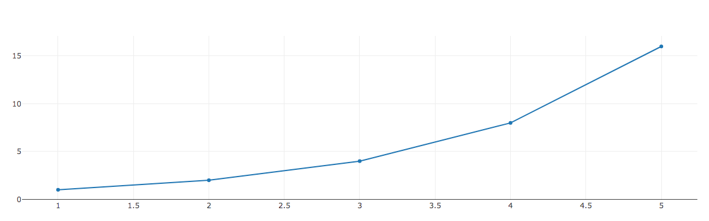
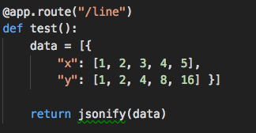
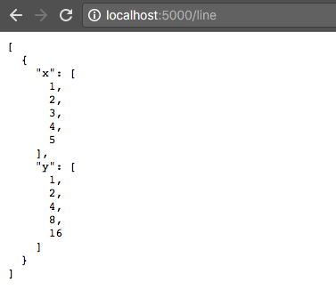
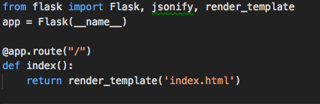
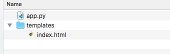
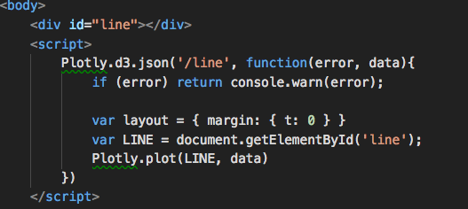

# Basic Flask

## Instructions

* In this activity, you will demonstrate a basic Flask app that uses Plotly to create a chart.

  * Inform the students that their objective for this demonstration is to familiarize themselves with creating an API endpoint with Flask, then calling it from the front end with Plotly and D3.

* First, start the server with `python app.py` in the directory, and open `localhost:5000` in your browser:

  

* Next, open `app.py` and begin to walk through the code with the class. We begin with the second route, `/line`:

  

* Ask students what they think this route will do, then open the browser with this route in the URL:

  

  * As expected, the data is returned as JSON.

* Next, discuss the default route, `/`:

  

* Ask your students what they think this route will do.

  * It uses flask's `render_template()` method to **serve** the `index.html` file, which is located in the `templates` directory.

  

* Now walk through the code in `index.html`:

  

* This is an emphatic point: An API call is made from `index.html` to the `/line` route. This is the same `/line` route from `app.py`.

  * The data is returned in the callback function as `data`, and a Plotly line chart is created using the data.

* Ask students to pair up with a partner to discuss the sequence of events.

  1. Flask serves the file `index.html` with the default route.
  2. Inside `index.html`, an AJAX call is placed to the `/line` route.
  3. Flask route `/line` is activated, and it serves the requested data to the front end.
  4. Plotly uses the received data to display the line chart.

* Answer any remaining questions before moving on.
