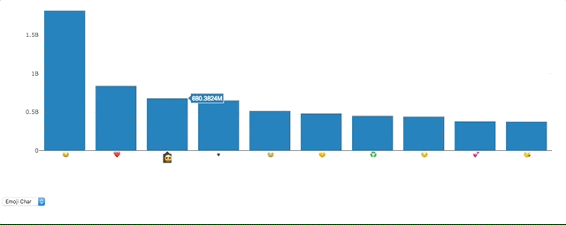
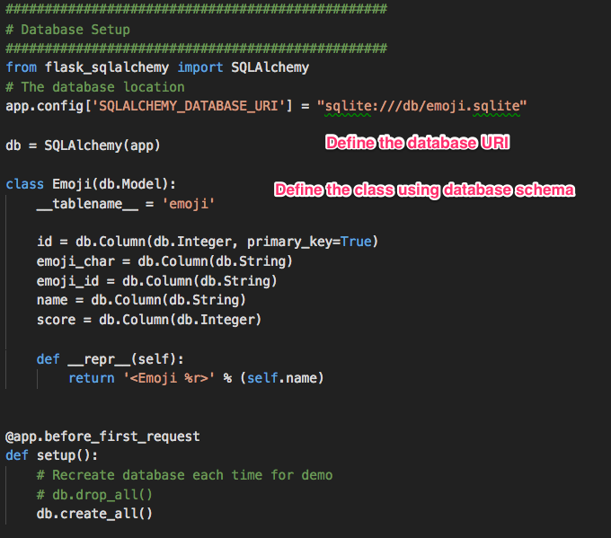
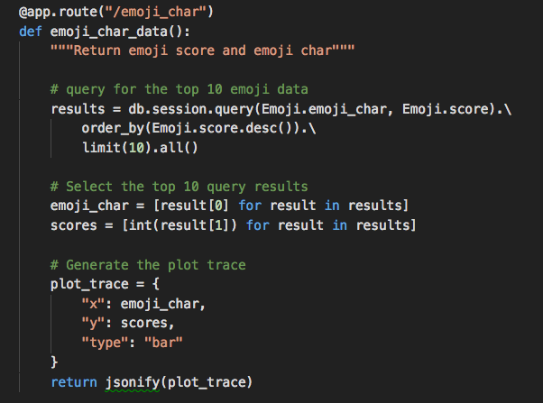
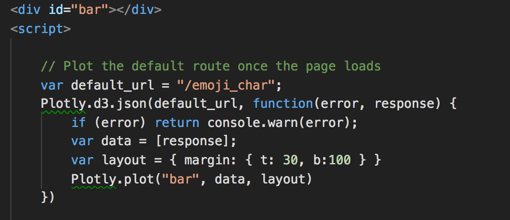
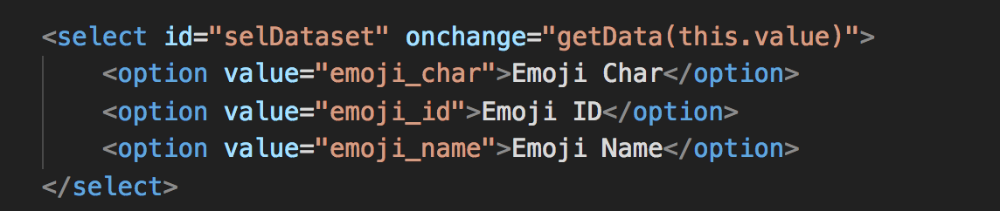
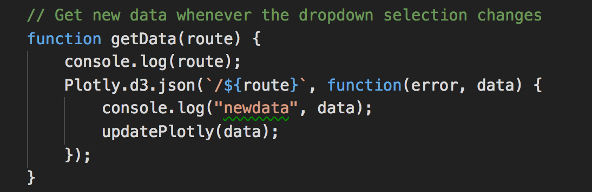
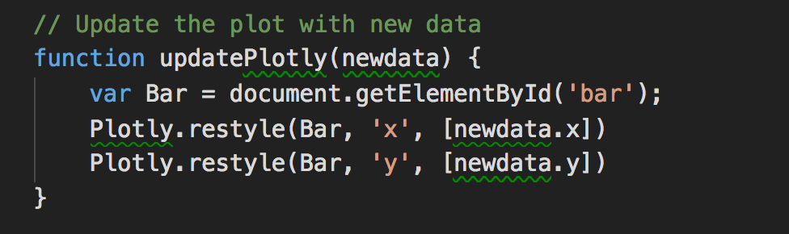
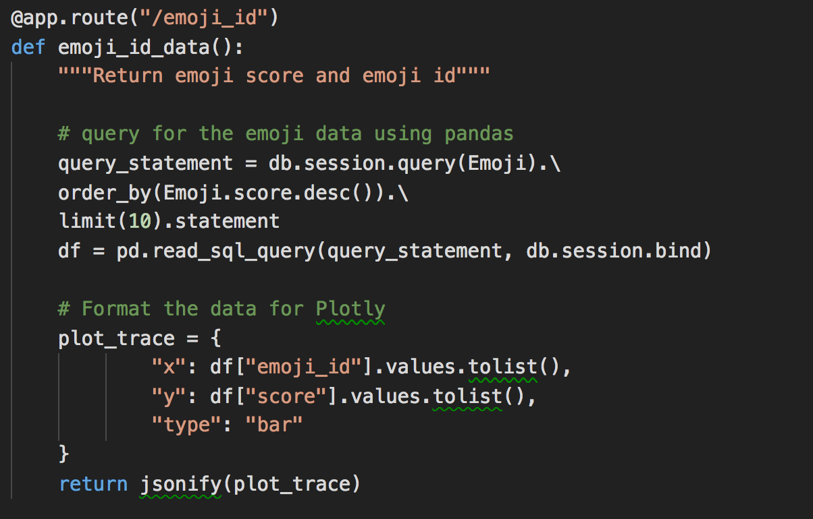

# A Full-stack Emoji App

## Instructions

* The goal of activity is to familiarize students with the components of a full-stack app with a database, a server with API routes, and a front-end that calls those API routes.

* Demonstrate the working app to students:

  

* Explain that much of the below, except for defining the `class` of the database, is boiler plate:

  

* Next, walk the class through the first route:

  

  * The route is `/emoji_char`.
  * The `results` returns from the database the first ten rows in the `emoji_char` and `score` columns (as Python objects, of course).
  * The data above can be accessed with `results[0]` and `results[1]`, respectively.
  * The data are inserted into a dictionary named `plot_trace`. The current route returns the JSON form of this data.

* Now let's turn to the front end, which defines the API call made to the `/emoji_char` route:

  

  * `d3.json()` places an API call to the `/emoji_char` route.
  * The JSONified form of `plot_trace` from the server is returned in a callback function here as `response`.
  * Before passing this information to Plotly, it is made an array and assigned to the variable `data`.
  * With `Plotly.plot()`, a bar chart is placed in the `div` that has the ID `bar`.

* Answer any questions at this point.

* As the above are important concepts, have students pair up with a partner, and take a few minutes to explain to each other the following:

  * What happens in database setup?
  * What happens inside the flask route?
  * What happens with the API call?

* Reconvene the class, and go over the events that take place with the dropdown menu selection.

* Ask the class how to create a dropdown menu in HTML, then show them this code:

  

  * The three `option` items represent each dropdown item.
  * `onchange="getData(this.value)"`: when the user selects an option different from the current one from the dropdown menu, the function `getData()`, which we define, is called.
  * The argument to the above function is the value of the option item, represented by `this.value`.

* Next, explain the `getData()` function:

  

  * `d3.json()` places an API call to the route (which is passed into the function as its parameter)
  * From the API call it obtains data
  * It then calls the `updatePlotly()` function, which will update the chart on the page.

* The `updatePlotly()` function simply restyles the plot with the new information:

  

* On the Flask backend, the route is created, database is queried, and a JSON form of the response is returned:

  

  * Explain that we can use bring in a SQLAlchemy query object into pandas. This is simply an alternative method of returning data.
  * We could also have bypassed pandas altogether, as in the first route.
  * pandas method `tolist()` is used to convert the data into a list.
  * Do not dwell on the details; this code is here for students' reference.
