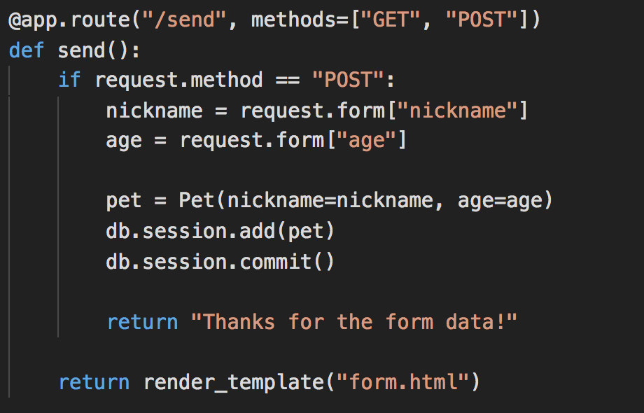
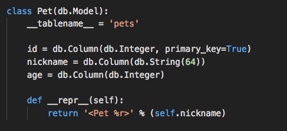
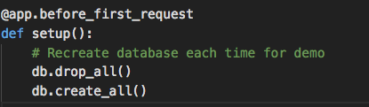
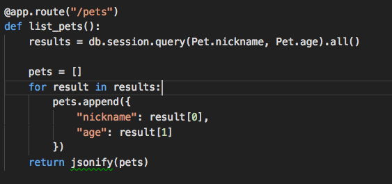
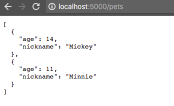
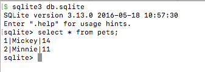

# Flask & SQLAlchemy

## Instructions

* So far, we have gone over retrieving and submitting information with GET and POST routes. But the data is not permanently saved, and is lost when we quit the server app.

* Inform the class that we'll now add this important functionality by writing to a SQL database.

* Note to the class that much of the code in the route remains familiar:

  

  * The route provisions for both GET and POST methods.

  * However, instead of appending the submitted information to a Python list, a new object as instantiated as `pet`.

  * And subsequently, the object is added by the SQLAlchemy session, and committed. In other words, the information is written to the SQL database.

* If you like, take a moment to go over the class `Pet` that models the database, but do not dwell too long.

  

* Bring to your class's attention that the existing database is dropped each time that the server is started because of `db.drop_all()`. Getting rid of this line in the code would make the database persistent.

  

* The `/pets` route, which retrieves data from the database, is much the same as before:

  

* Demonstrate the application in the browser.

  

* If time allows, you might also query the database file with sqlite3 to demonstrate the app.

  

* Answer any questions that students may have.
