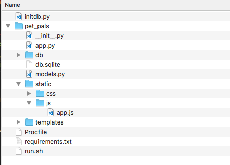
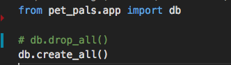
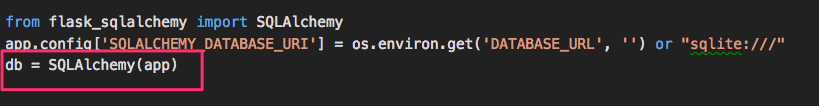
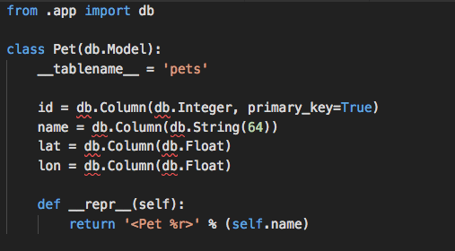
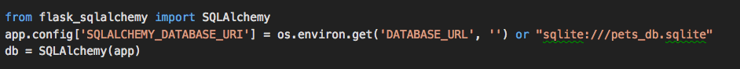

# Refactoring Code

## Instructions

* In this activity, you will introduce students to refactoring code, or the process of reorganizing code to improve its logical structuring.

* First, open the directory and discuss `__init__.py`

  

  * It can be a blank file, as it is in this case.
  * It marks its parent directory as a Python package.
  * Students who are curious about `__init__.py` can consult this link, which provides further information: [https://stackoverflow.com/questions/448271/what-is-init-py-for](https://stackoverflow.com/questions/448271/what-is-init-py-for)

* Open `initdb.py`. Ask students to parse the import statement.

  

* In the `pet_pals` directory, there is `app.py`. From it, import `db`, which is a running instance of SQLAlchemy.

  

  * `pet_pals.app` here, then, means `app.py` in `pet_pals`.

* Next, open `models.py`

  

  * The class model of the SQL table is defined here.
  * Here, too, `db` is imported from `app.py`.
  * Unlike in previous examples, the model for the database has been separated out. This concept is called the separation of concerns: [https://stackoverflow.com/questions/98734/what-is-separation-of-concerns](https://stackoverflow.com/questions/98734/what-is-separation-of-concerns).
  * Separation of concerns leads to better organized code and easier troubleshooting.

* In `app.py`, explain that `DATABASE_URL` would be replaced by the connection string to the cloud database during deployment on Heroku, for example.

  
