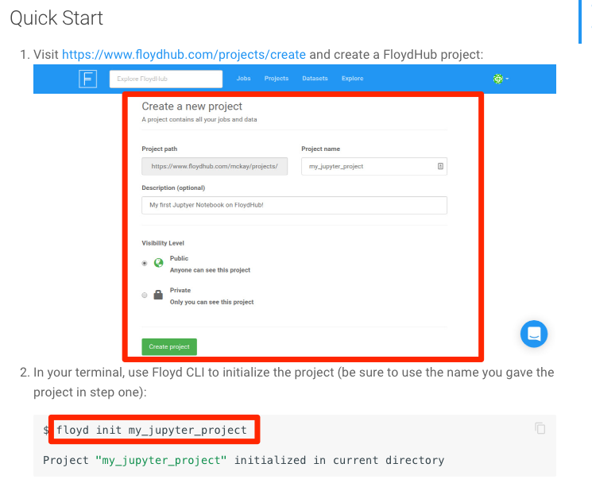
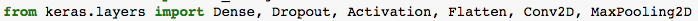
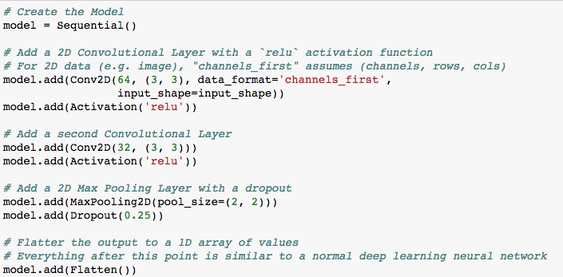
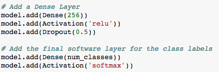
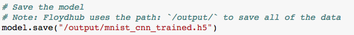
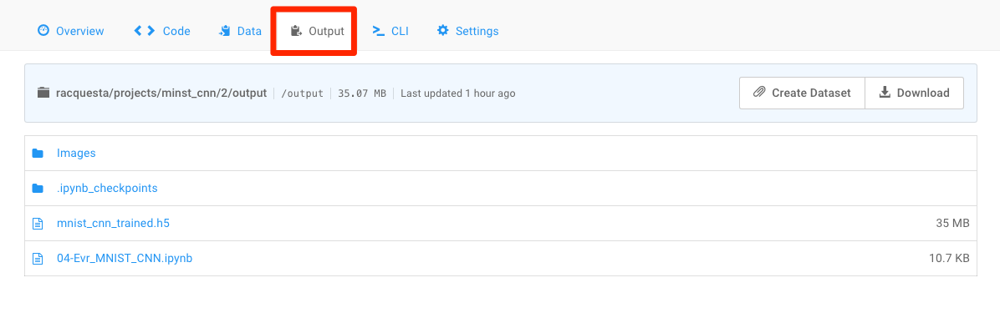

### MNIST CNN (0:20)

* **File**: [MNIST_CNN.ipynb](Unsolved/MNIST_CNN.ipynb)

* Explain that the MNIST model can be improved by using a CNN.

* Walk students through the process of running a Jupyter Notebook on Floydhub. Slack out these [instructions](https://docs.floydhub.com/getstarted/quick_start_jupyter/) and have students complete only steps 1 and 2.

  

* After student initialize their project in the folder containing their starter file, have them run the following command in place of step 3.


```
floyd run --gpu --env keras --mode jupyter
```

* Open the Notebook with the starter code for this activity.  Use the solved version, [MNIST_CNN.ipynb](Solved/MNIST_CNN.ipynb), for reference.

* Once everyone has a Jupyter Notebook running on Floydhub, walk through the following:

  * Explain that we are going to add new layers for our CNN model: Dropout, Activation, Flatten, Conv2D, MaxPooling2D

    

  * Start by pre-processing the images using the boilerplate code. Don't spend too much time on this.

  * Explain that the first layer of the CNN will be a `Conv2D` layer with the `ReLu` activation function. `Conv2D` layers apply filters to the image. Several of these features are usually stacked together with each filter responsible for detecting a different shape, edge, color, or texture.

  * Add a second `Conv2D` layer in this network. This layer has 32 filters stacked in it.

  * Explain that a 2D Max Pooling layer with a dropout of 0.25 is applied. Max Pooling simply takes the max value from a window of pixels. This helps us reduce the dimensionality of the image and thus reduces the complexity of the network. The dropout simply drops some of the layer connections to help us avoid over-fitting. Slack out this [paper](http://www.cs.toronto.edu/~rsalakhu/papers/srivastava14a.pdf) as a reference.

  * The final stage of the CNN is to flatten the model to a 1D array. Everything after this step is just a normal deep learning neural network. CNN architectures often start with `Conv2D` and `MaxPooling` layers and then flatten out at the final stage to perform classification as a normal deep neural network.

    

  * Show that the final stage is just a `Dense` layer with a `Dropout` followed by a final `softmax` activation function to perform the logistic regression that chooses our labels.

  * After compiling the model, fit the model to the training data. This example uses 10 epochs (training cycles), but in reality, many more epochs might be required to get a finely tuned model.

    

  * Finally, save the model to the `/output/` directory in Floydhub.

    

  * Point out that even running with GPUs in the cloud, training a deep CNN model takes a long time.

  * Run the notebook and explain that we will let this model train and check the progress later.

  \*\* When the training has completed, close and halt the jupyter notebook and cancel the project on Floydhub. This will prevent further charges to the account.

  * Show students that they can go to the outputs tab for the project and download the trained model `mnist_cnn_trained.h5`. This trained model can then be loaded and used again in the future.

    
