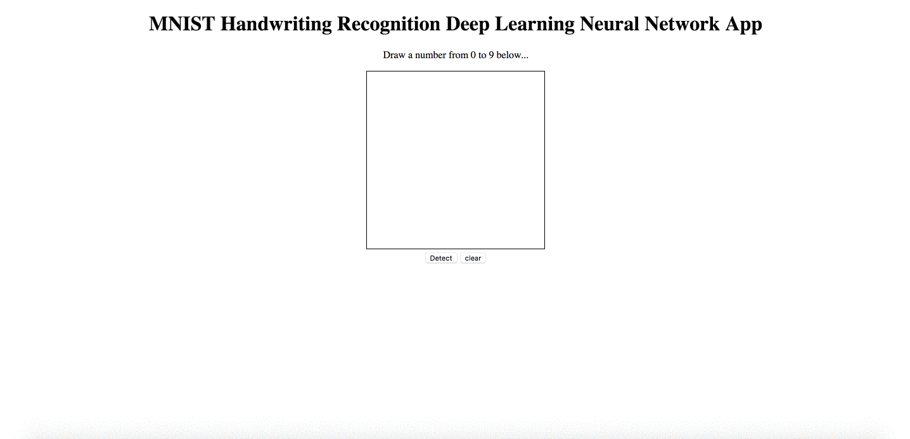
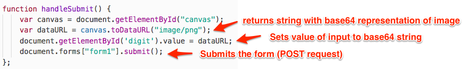
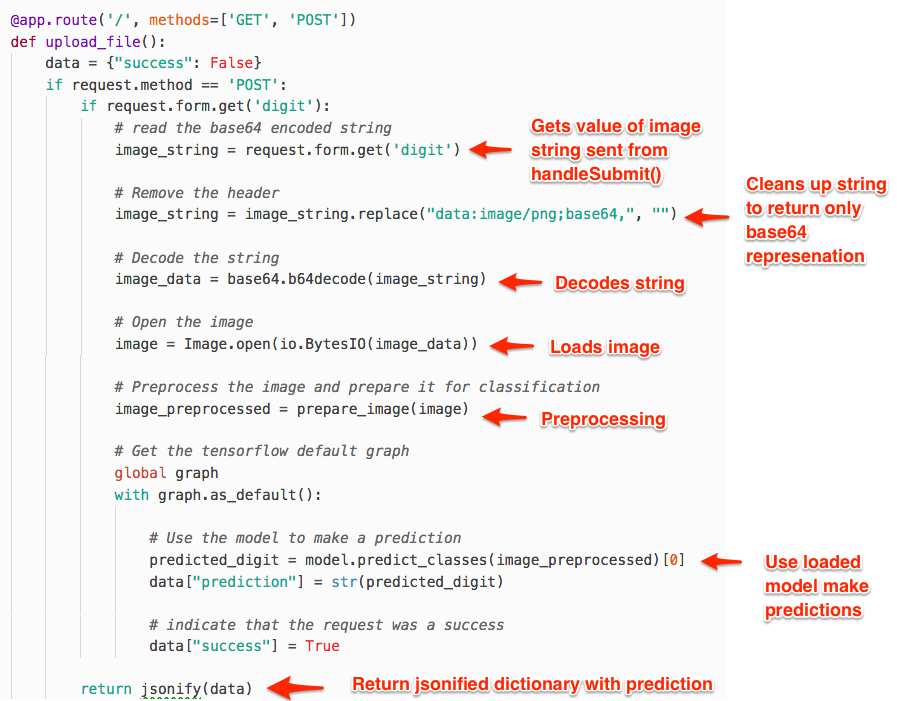

### Everyone Do: Flask MNIST Heroku (0:15)

* Explain that we are going to create a full-stack machine learning app that will take a user drawn digit and predict the result using our MNIST handwriting recognition model.

* Start with a quick demo of the application to show the functionality: <https://deep-digits.herokuapp.com/>.

  

* Open the `index.html` file and explain that we are using a HTML canvas object to allow users to draw on the screen. This canvas code was adapted from the [link](https://jsfiddle.net/j3xDg/), but there are many different examples of canvas drawing apps out there.

* Explain that the most important part of the canvas code is the `handleSubmit` function where we convert a canvas drawing to a base64 representation of the image. Slack out the following link for more background on [base64](https://en.wikipedia.org/wiki/Base64), but explain that the main idea is that you are encoding an image as a string that can be sent over the network.

* Explain that we send the string representation of an image by first setting the value of our form input to the string and then submitting the form.

  

* Next, open the `app.py` file and show the route that handles our form.

* Explain that the form receives the string representation of the image as a dictionary with the key `digit` from our form input.

* Show that the base64 encoded string contains a header that needs to be removed before decoding the string back to an image. We use `replace("data:image/png;base64,", "")` to strip this header off of the string.

* Next, we use the Python `base64` library to decode our image. This converts the string back into the binary version of the image.

* We can then use the same code to create a PIL image that we used previously.

* The remaining code is basically the same as before. We preprocess the image and then use our trained model to predict the image.

  
